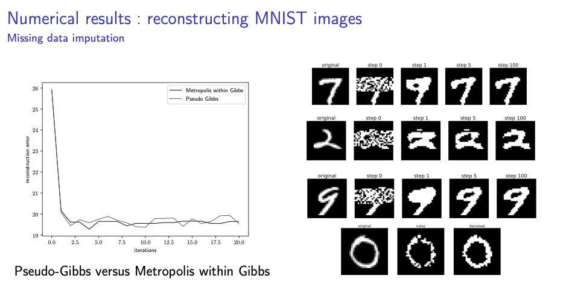

# Deep Reconstruction

An implementation of the Locally Linear Order Book model as introduced by Donier *et al.* in the paper [Leveraging the Exact Likelihood of Deep Latent Variable Models](https://arxiv.org/abs/1802.04826).

### Example output
